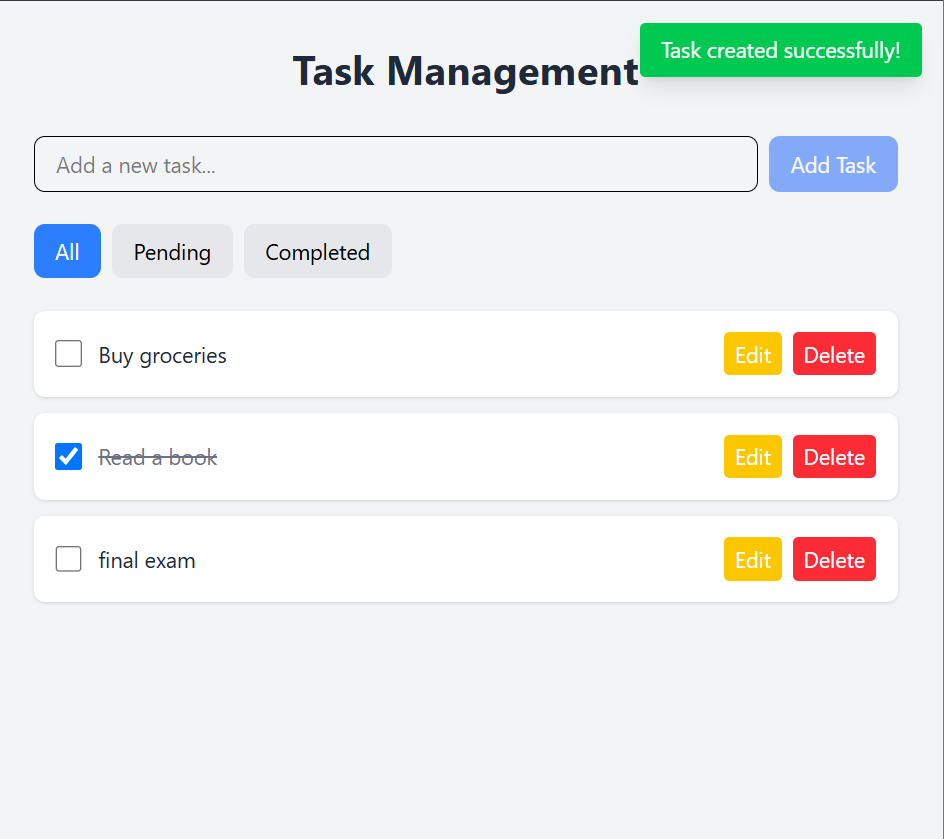

# Task Management Application

A simple task management application built with React and Tailwind CSS.

## Features

- View a list of tasks
- Add new tasks
- Mark tasks as completed
- Delete tasks
- Filter tasks (All, Active, Completed)

## Getting Started

### Prerequisites

- Node.js (v14 or higher)
- npm or yarn

### Installation

1. Clone the repository:
```bash
git clone <https://github.com/Emnet-tes/task-management.git>
cd task-management
```

2. Install dependencies:
```bash
npm install
```

3. Start the development server:
```bash
npm run dev
```

4. Open your browser and navigate to `http://localhost:5173`

## Usage

- **Adding a Task**: Type a task title in the input field and click "Add Task" or press Enter
- **Completing a Task**: Click the checkbox next to a task to mark it as completed
- **Deleting a Task**: Click the "Delete" button next to a task to remove it
- **Editing a Task**: Click the "Edit" button next to a task to remove it
- **Filtering Tasks**: Use the filter buttons (All, Pending, Completed) to view different task states

## Technologies Used

- React
- TypeScript
- Tailwind CSS
- Vite

## Project Structure

```
src/
  ├── App.tsx        # Main application component
  ├── index.css      # Global styles and Tailwind imports
  └── main.tsx       # Application entry point
```

## Screenshot

